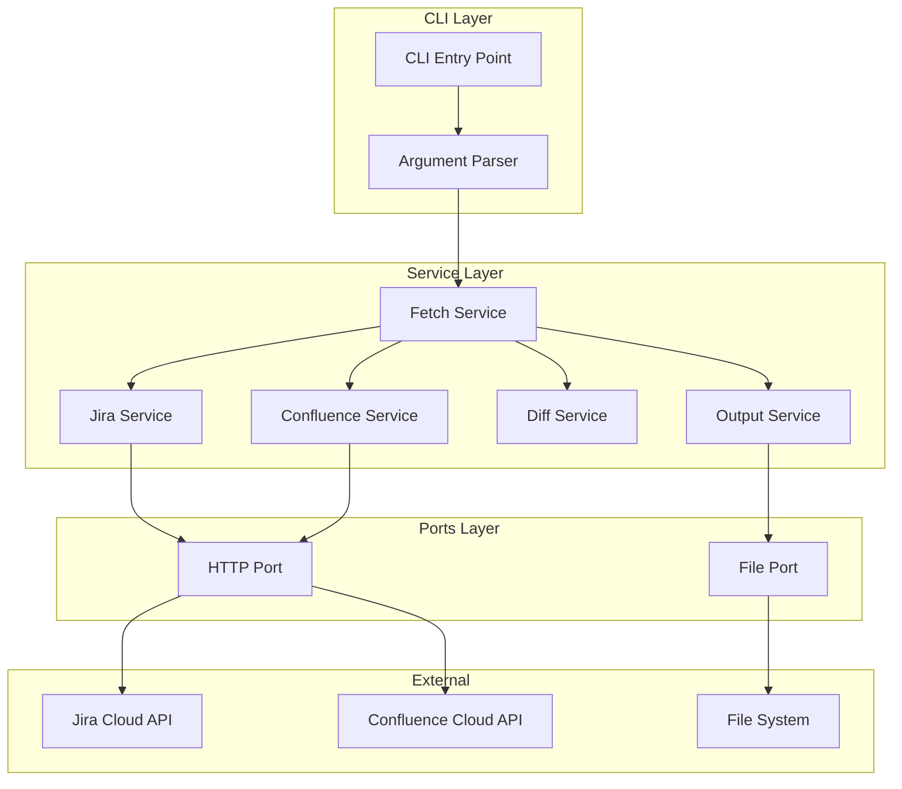
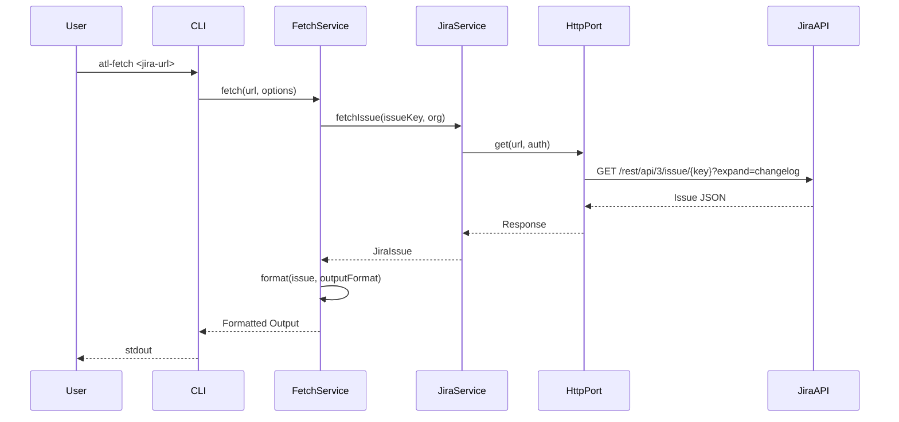
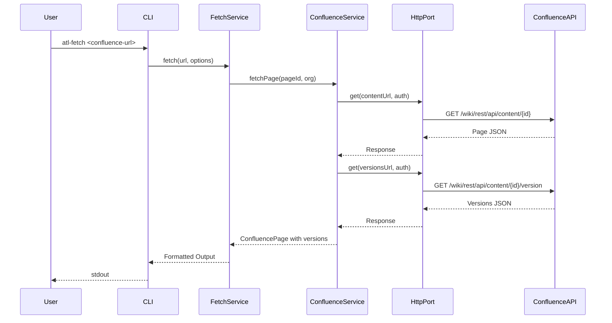
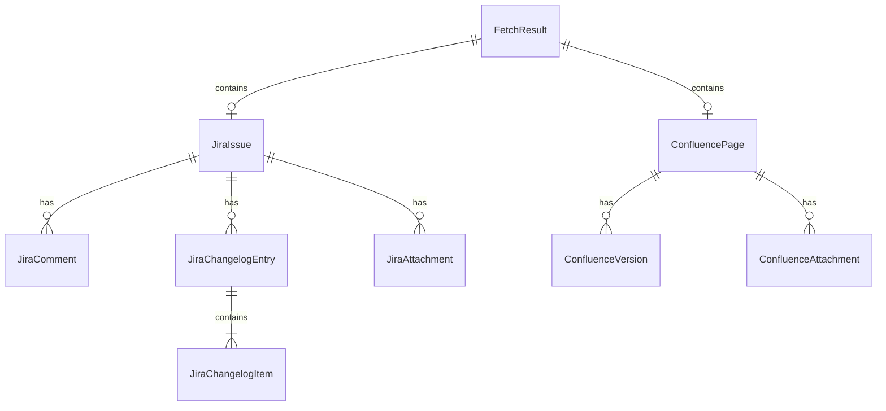

# Technical Design Document

## Overview

**Purpose**: 本機能は、Atlassian Cloud（Jira/Confluence）の URL から本文、変更履歴、コメント、添付ファイルを取得する CLI ツールを提供する。

**Users**: 開発者、プロジェクトマネージャー、ドキュメント管理者が Issue/ページ情報のバックアップ、分析、他システムへの連携に使用する。

**Impact**: 既存の atl-fetch プロジェクトに Atlassian Cloud API 連携機能を追加し、CLI コマンドとして公開する。

### Goals

- Atlassian Cloud URL から Jira Issue / Confluence ページの情報を取得
- 変更履歴（Jira changelog、Confluence バージョン）の取得と差分表示
- JSON / Markdown / YAML 形式での出力対応
- 添付ファイルのダウンロード機能

### Non-Goals

- Atlassian Server/Data Center のサポート（Cloud のみ）
- Issue/ページの作成・更新・削除（読み取り専用）
- OAuth 2.0 認証フロー（API Token のみ）
- リアルタイム監視・Webhook 連携

## Architecture

### Architecture Pattern & Boundary Map



**Architecture Integration**:

- **Selected pattern**: Layered Architecture + Ports パターン（既存の structure.md に準拠）
- **Domain/feature boundaries**: CLI Layer（入力処理）、Service Layer（ビジネスロジック）、Ports Layer（外部依存抽象化）
- **Existing patterns preserved**: ESM モジュール、TypeScript strict mode、ports による外部依存抽象化
- **New components rationale**: Atlassian API 連携、diff 生成、複数出力形式対応のため各サービスを分離
- **Steering compliance**: structure.md のディレクトリパターン遵守（CLI フレームワークは yargs に変更）

### Technology Stack

| Layer | Choice / Version | Role in Feature | Notes |
|-------|------------------|-----------------|-------|
| CLI | yargs 18.x | コマンドライン引数解析 | ESM first、豊富な機能、自動補完対応 |
| HTTP | got 14.x | Atlassian API 通信 | リトライ・タイムアウト内蔵、ストリーム対応 |
| Result | neverthrow 8.x | エラーハンドリング | 型安全な Result 型、メソッドチェーン対応 |
| Validation | zod 4.x | スキーマバリデーション | 型推論、API レスポンス・出力データ検証 |
| Env | @t3-oss/env-core 0.x | 環境変数バリデーション | zod ベース、型安全な環境変数管理 |
| Diff | diff 8.x | 差分計算 | 文字/単語/行レベル対応、型定義同梱 |
| YAML | yaml 2.x | YAML 出力 | YAML 1.2 準拠、TypeScript サポート |
| Runtime | Node.js 22+ | 実行環境 | ESM ネイティブ |

## System Flows

### Jira Issue 取得フロー



### Confluence ページ取得フロー



## Requirements Traceability

| Requirement | Summary | Components | Interfaces | Flows |
|-------------|---------|------------|------------|-------|
| 1.1, 1.2 | URL 解析 | UrlParser | parseUrl() | - |
| 1.3, 1.4 | URL バリデーション | UrlParser | validateUrl() | - |
| 2.1 | 環境変数から認証情報取得 | AuthService | getCredentials() | - |
| 2.2, 2.3 | 認証エラーハンドリング | AuthService, HttpPort | - | - |
| 3.1, 3.2, 3.3, 3.4 | Jira Issue 取得 | JiraService | fetchIssue() | Jira 取得フロー |
| 3.5 | Jira 添付ダウンロード | JiraService, FilePort | downloadAttachment() | - |
| 3.6, 3.7 | Jira エラーハンドリング | JiraService | - | - |
| 4.1, 4.2, 4.3, 4.4 | Confluence ページ取得 | ConfluenceService | fetchPage() | Confluence 取得フロー |
| 4.5 | Confluence 添付ダウンロード | ConfluenceService, FilePort | downloadAttachment() | - |
| 4.6, 4.7 | Confluence エラーハンドリング | ConfluenceService | - | - |
| 5.1, 5.2 | 差分表示 | DiffService | generateDiff() | - |
| 5.3, 5.4, 5.5 | diff 出力オプション | DiffService, OutputService | formatDiff() | - |
| 6.1, 6.2, 6.3 | 出力形式 | OutputService | format() | - |
| 6.4 | ファイル出力 | OutputService, FilePort | writeFile() | - |
| 6.5 | 進捗表示 | OutputService | showProgress() | - |
| 7.1-7.9 | CLI インターフェース | CLI, ArgParser | - | - |
| 8.1-8.9 | ドキュメント | - | - | - |

## Components and Interfaces

| Component | Domain/Layer | Intent | Req Coverage | Key Dependencies | Contracts |
|-----------|--------------|--------|--------------|------------------|-----------|
| CLI | CLI | コマンドエントリーポイント | 7.1-7.9 | yargs (P0) | - |
| UrlParser | Service | URL 解析・バリデーション | 1.1-1.4 | - | Service |
| AuthService | Service | 認証情報管理 | 2.1-2.3 | @t3-oss/env-core (P0), zod (P0) | Service |
| JiraService | Service | Jira API 操作 | 3.1-3.7 | HttpPort (P0), zod (P0) | Service |
| ConfluenceService | Service | Confluence API 操作 | 4.1-4.7 | HttpPort (P0), zod (P0) | Service |
| DiffService | Service | 差分計算 | 5.1-5.5 | diff (P0) | Service |
| OutputService | Service | 出力フォーマット | 6.1-6.5 | yaml (P1), FilePort (P1) | Service |
| HttpPort | Ports | HTTP 通信抽象化 | - | got (P0) | Service |
| FilePort | Ports | ファイル操作抽象化 | - | node:fs (P0) | Service |

### Service Layer

#### UrlParser

| Field | Detail |
|-------|--------|
| Intent | Atlassian Cloud URL を解析し、組織名、リソースタイプ、ID を抽出する |
| Requirements | 1.1, 1.2, 1.3, 1.4 |

**Responsibilities & Constraints**

- Jira Issue URL と Confluence ページ URL の両形式をサポート
- 複数の URL パターン（browse、wiki/spaces など）に対応
- 不正な URL に対して明確なエラーを返す

**Dependencies**

- Inbound: FetchService — URL 解析依頼 (P0)
- External: なし

**Contracts**: Service [x]

##### Service Interface

```typescript
interface UrlParseResult {
  readonly type: 'jira' | 'confluence';
  readonly organization: string;
  readonly resourceId: string;
  readonly projectKey?: string;
  readonly spaceKey?: string;
}

interface UrlParserService {
  parse(url: string): Result<UrlParseResult, UrlParseError>;
  validate(url: string): Result<void, UrlValidationError>;
}

type UrlParseError =
  | { kind: 'INVALID_FORMAT'; message: string }
  | { kind: 'UNSUPPORTED_HOST'; message: string }
  | { kind: 'MISSING_RESOURCE_ID'; message: string };

type UrlValidationError =
  | { kind: 'NOT_ATLASSIAN_CLOUD'; message: string }
  | { kind: 'UNSUPPORTED_RESOURCE'; message: string };
```

- Preconditions: url は空文字列でないこと
- Postconditions: 成功時は UrlParseResult を返す、失敗時は具体的なエラー種別を返す
- Invariants: 同一 URL に対して常に同一の結果を返す

#### AuthService

| Field | Detail |
|-------|--------|
| Intent | 環境変数から認証情報を取得し、Basic Auth ヘッダーを生成する |
| Requirements | 2.1, 2.2, 2.3 |

**Responsibilities & Constraints**

- `@t3-oss/env-core` + `zod` で環境変数 `ATLASSIAN_EMAIL` と `ATLASSIAN_API_TOKEN` をバリデーション
- Basic Auth 形式（base64 エンコード）でヘッダーを生成
- 認証情報が未設定または不正な場合は明確なエラーを返す

**Dependencies**

- Inbound: JiraService, ConfluenceService — 認証ヘッダー取得 (P0)
- External: @t3-oss/env-core (P0), zod (P0)

**Contracts**: Service [x]

##### Environment Schema

```typescript
import { createEnv } from '@t3-oss/env-core';
import { z } from 'zod';

const env = createEnv({
  server: {
    ATLASSIAN_EMAIL: z.email('有効なメールアドレスを指定してください'),
    ATLASSIAN_API_TOKEN: z.string().min(1, 'API トークンは必須です'),
  },
  runtimeEnv: process.env,
});
```

##### Service Interface

```typescript
interface Credentials {
  readonly email: string;
  readonly apiToken: string;
}

interface AuthServiceInterface {
  getCredentials(): Result<Credentials, AuthError>;
  getAuthHeader(): Result<string, AuthError>;
}

type AuthError =
  | { kind: 'MISSING_EMAIL'; message: string }
  | { kind: 'MISSING_TOKEN'; message: string }
  | { kind: 'INVALID_EMAIL'; message: string }
  | { kind: 'INVALID_CREDENTIALS'; message: string };
```

- Preconditions: なし
- Postconditions: 成功時は `Authorization: Basic <base64>` 形式の文字列を返す
- Invariants: 同一環境変数に対して常に同一のヘッダーを返す

#### JiraService

| Field | Detail |
|-------|--------|
| Intent | Jira Cloud API を使用して Issue 情報を取得する |
| Requirements | 3.1, 3.2, 3.3, 3.4, 3.5, 3.6, 3.7 |

**Responsibilities & Constraints**

- Issue の本文、コメント、changelog、添付ファイル一覧を取得
- expand パラメータで必要なフィールドを展開
- `zod` で API レスポンスをバリデーション
- 404/403 エラーを適切にハンドリング

**Dependencies**

- Inbound: FetchService — Issue 取得依頼 (P0)
- Outbound: HttpPort — API 通信 (P0), AuthService — 認証 (P0)
- External: Jira Cloud REST API v3 (P0), zod (P0)

**Contracts**: Service [x]

##### Service Interface

```typescript
interface JiraIssue {
  readonly key: string;
  readonly summary: string;
  readonly description: string | null;
  readonly comments: readonly JiraComment[];
  readonly changelog: readonly JiraChangelogEntry[];
  readonly attachments: readonly JiraAttachment[];
}

interface JiraComment {
  readonly id: string;
  readonly author: string;
  readonly body: string;
  readonly created: string;
  readonly updated: string;
}

interface JiraChangelogEntry {
  readonly id: string;
  readonly author: string;
  readonly created: string;
  readonly items: readonly JiraChangelogItem[];
}

interface JiraChangelogItem {
  readonly field: string;
  readonly fromString: string | null;
  readonly toString: string | null;
}

interface JiraAttachment {
  readonly id: string;
  readonly filename: string;
  readonly mimeType: string;
  readonly size: number;
  readonly contentUrl: string;
}

interface JiraServiceInterface {
  fetchIssue(organization: string, issueKey: string): Promise<Result<JiraIssue, JiraError>>;
  downloadAttachment(attachment: JiraAttachment, destPath: string): Promise<Result<void, JiraError>>;
}

type JiraError =
  | { kind: 'NOT_FOUND'; message: string }
  | { kind: 'FORBIDDEN'; message: string }
  | { kind: 'AUTH_FAILED'; message: string }
  | { kind: 'NETWORK_ERROR'; message: string }
  | { kind: 'PARSE_ERROR'; message: string };
```

- Preconditions: organization と issueKey が有効な文字列であること
- Postconditions: 成功時は完全な JiraIssue オブジェクトを返す
- Invariants: API レスポンスのスキーマが変わらない限り同一結果

#### ConfluenceService

| Field | Detail |
|-------|--------|
| Intent | Confluence Cloud API を使用してページ情報とバージョン履歴を取得する |
| Requirements | 4.1, 4.2, 4.3, 4.4, 4.5, 4.6, 4.7 |

**Responsibilities & Constraints**

- ページの本文、バージョン一覧、各バージョンの内容を取得
- 添付ファイル一覧とダウンロード機能を提供
- `zod` で API レスポンスをバリデーション
- 404/403 エラーを適切にハンドリング

**Dependencies**

- Inbound: FetchService — ページ取得依頼 (P0)
- Outbound: HttpPort — API 通信 (P0), AuthService — 認証 (P0)
- External: Confluence Cloud REST API v1 (P0), zod (P0)

**Contracts**: Service [x]

##### Service Interface

```typescript
interface ConfluencePage {
  readonly id: string;
  readonly title: string;
  readonly body: string;
  readonly spaceKey: string;
  readonly currentVersion: number;
  readonly versions: readonly ConfluenceVersion[];
  readonly attachments: readonly ConfluenceAttachment[];
}

interface ConfluenceVersion {
  readonly number: number;
  readonly by: string;
  readonly when: string;
  readonly message: string | null;
  readonly body?: string;
}

interface ConfluenceAttachment {
  readonly id: string;
  readonly title: string;
  readonly mediaType: string;
  readonly fileSize: number;
  readonly downloadUrl: string;
}

interface ConfluenceServiceInterface {
  fetchPage(organization: string, pageId: string): Promise<Result<ConfluencePage, ConfluenceError>>;
  fetchVersionContent(organization: string, pageId: string, versionNumber: number): Promise<Result<string, ConfluenceError>>;
  downloadAttachment(attachment: ConfluenceAttachment, destPath: string): Promise<Result<void, ConfluenceError>>;
}

type ConfluenceError =
  | { kind: 'NOT_FOUND'; message: string }
  | { kind: 'FORBIDDEN'; message: string }
  | { kind: 'AUTH_FAILED'; message: string }
  | { kind: 'NETWORK_ERROR'; message: string }
  | { kind: 'PARSE_ERROR'; message: string };
```

- Preconditions: organization と pageId が有効な文字列であること
- Postconditions: 成功時は完全な ConfluencePage オブジェクトを返す
- Invariants: バージョン番号は 1 以上の整数

#### DiffService

| Field | Detail |
|-------|--------|
| Intent | 変更履歴の差分を計算し、unified diff 形式で出力する |
| Requirements | 5.1, 5.2, 5.3, 5.4, 5.5 |

**Responsibilities & Constraints**

- Jira changelog のフィールド変更を差分形式で表示
- Confluence バージョン間の本文差分を計算
- unified diff 形式、カラー出力対応

**Dependencies**

- Inbound: FetchService — 差分計算依頼 (P0)
- External: diff ライブラリ (P0)

**Contracts**: Service [x]

##### Service Interface

```typescript
interface DiffOptions {
  readonly colorEnabled: boolean;
  readonly contextLines?: number;
}

interface DiffResult {
  readonly hunks: readonly DiffHunk[];
  readonly formatted: string;
}

interface DiffHunk {
  readonly oldStart: number;
  readonly oldLines: number;
  readonly newStart: number;
  readonly newLines: number;
  readonly lines: readonly DiffLine[];
}

interface DiffLine {
  readonly type: 'add' | 'remove' | 'context';
  readonly content: string;
}

interface DiffServiceInterface {
  diffText(oldText: string, newText: string, options: DiffOptions): DiffResult;
  formatJiraChangelog(changelog: readonly JiraChangelogEntry[], options: DiffOptions): string;
  formatConfluenceVersionDiff(oldVersion: ConfluenceVersion, newVersion: ConfluenceVersion, options: DiffOptions): string;
}
```

- Preconditions: なし（空文字列も有効）
- Postconditions: unified diff 形式の文字列を返す
- Invariants: 同一入力に対して同一出力

#### OutputService

| Field | Detail |
|-------|--------|
| Intent | 取得したデータを指定形式（JSON/Markdown/YAML）で出力する |
| Requirements | 6.1, 6.2, 6.3, 6.4, 6.5 |

**Responsibilities & Constraints**

- JSON（デフォルト）、Markdown、YAML 形式での出力
- 標準出力またはファイルへの書き込み
- ダウンロード進捗の表示

**Dependencies**

- Inbound: FetchService — 出力依頼 (P0)
- Outbound: FilePort — ファイル書き込み (P1)
- External: yaml ライブラリ (P1)

**Contracts**: Service [x]

##### Service Interface

```typescript
type OutputFormat = 'json' | 'markdown' | 'yaml';

interface OutputOptions {
  readonly format: OutputFormat;
  readonly outputPath?: string;
  readonly colorEnabled: boolean;
}

interface OutputServiceInterface {
  formatJiraIssue(issue: JiraIssue, options: OutputOptions): string;
  formatConfluencePage(page: ConfluencePage, options: OutputOptions): string;
  write(content: string, options: OutputOptions): Promise<Result<void, OutputError>>;
  showProgress(message: string, current: number, total: number): void;
}

type OutputError =
  | { kind: 'WRITE_FAILED'; message: string }
  | { kind: 'INVALID_FORMAT'; message: string };
```

- Preconditions: format は有効な値であること
- Postconditions: 指定形式でフォーマットされた文字列を返す
- Invariants: JSON 出力は有効な JSON 文字列

### Ports Layer

#### HttpPort

| Field | Detail |
|-------|--------|
| Intent | HTTP 通信を抽象化し、テスト容易性を確保する |
| Requirements | - |

**Responsibilities & Constraints**

- fetch API のラッパーとして動作
- 認証ヘッダーの付与
- エラーレスポンスの統一的なハンドリング

**Dependencies**

- Inbound: JiraService, ConfluenceService — HTTP 通信 (P0)
- External: got ライブラリ (P0)

**Contracts**: Service [x]

##### Service Interface

```typescript
interface HttpRequestOptions {
  readonly method?: 'GET' | 'POST' | 'PUT' | 'DELETE';
  readonly headers?: Record<string, string>;
  readonly body?: string;
}

interface HttpResponse<T> {
  readonly status: number;
  readonly headers: Record<string, string>;
  readonly data: T;
}

interface HttpPortInterface {
  request<T>(url: string, options?: HttpRequestOptions): Promise<Result<HttpResponse<T>, HttpError>>;
  download(url: string, destPath: string, headers?: Record<string, string>): Promise<Result<void, HttpError>>;
}

type HttpError =
  | { kind: 'NETWORK_ERROR'; message: string }
  | { kind: 'TIMEOUT'; message: string }
  | { kind: 'HTTP_ERROR'; status: number; message: string };
```

#### FilePort

| Field | Detail |
|-------|--------|
| Intent | ファイルシステム操作を抽象化し、テスト容易性を確保する |
| Requirements | - |

**Responsibilities & Constraints**

- ファイル書き込み・読み取り操作
- ディレクトリ作成
- パス操作

**Dependencies**

- Inbound: OutputService, JiraService, ConfluenceService — ファイル操作 (P1)
- External: node:fs/promises (P0)

**Contracts**: Service [x]

##### Service Interface

```typescript
interface FilePortInterface {
  writeFile(path: string, content: string): Promise<Result<void, FileError>>;
  writeStream(path: string, stream: ReadableStream): Promise<Result<void, FileError>>;
  ensureDir(path: string): Promise<Result<void, FileError>>;
  exists(path: string): Promise<boolean>;
}

type FileError =
  | { kind: 'WRITE_FAILED'; path: string; message: string }
  | { kind: 'PERMISSION_DENIED'; path: string; message: string }
  | { kind: 'DISK_FULL'; path: string; message: string };
```

## Data Models

### Domain Model



**Aggregates**:

- `FetchResult`: 取得結果のルートエンティティ（Jira または Confluence）
- `JiraIssue`: Jira Issue の集約ルート
- `ConfluencePage`: Confluence ページの集約ルート

**Business Rules**:

- JiraIssue.key は `PROJECT-123` 形式
- ConfluencePage.id は数値文字列
- バージョン番号は 1 以上の整数

### Logical Data Model

**FetchResult**: Jira または Confluence のいずれかを含む判別共用体

```typescript
type FetchResult =
  | { type: 'jira'; data: JiraIssue }
  | { type: 'confluence'; data: ConfluencePage };
```

### Output Directory Structure

ファイル保存時のディレクトリ構造（`--download` オプション使用時）:

```text
{output-dir}/
├── jira/
│   └── {ISSUE-KEY}/
│       ├── manifest.json          # 取得メタデータ
│       ├── issue.json             # Issue 全データ（JSON形式）
│       ├── issue.yaml             # Issue 全データ（YAML形式、--format yaml時）
│       ├── issue.md               # Issue 全データ（Markdown形式、--format markdown時）
│       ├── description.txt        # 説明文のプレーンテキスト
│       ├── changelog.json         # 変更履歴
│       ├── comments.json          # コメント一覧
│       ├── attachments.json       # 添付ファイル一覧メタデータ
│       └── attachments/           # 添付ファイル実体
│           ├── image.png
│           └── document.pdf
└── confluence/
    └── {PAGE-ID}/
        ├── manifest.json          # 取得メタデータ
        ├── page.json              # ページ全データ（JSON形式）
        ├── page.yaml              # ページ全データ（YAML形式）
        ├── page.md                # ページ全データ（Markdown形式）
        ├── content.txt            # 本文のプレーンテキスト（最新版）
        ├── versions.json          # バージョン一覧メタデータ
        ├── versions/              # 各バージョンの内容
        │   ├── v1/
        │   │   ├── content.json   # v1 の全データ
        │   │   └── content.txt    # v1 のプレーンテキスト
        │   ├── v2/
        │   │   ├── content.json   # v2 の全データ
        │   │   ├── content.txt    # v2 のプレーンテキスト
        │   │   ├── diff.txt       # v1 → v2 の差分（unified diff形式）
        │   │   └── diff.json      # v1 → v2 の差分メタデータ
        │   └── v3/
        │       ├── content.json
        │       ├── content.txt
        │       ├── diff.txt       # v2 → v3 の差分
        │       └── diff.json
        ├── attachments.json       # 添付ファイル一覧メタデータ
        └── attachments/
            └── diagram.png
```

### Output Data Contracts

#### Manifest Schema

```typescript
interface Manifest {
  /** 取得対象の種別 */
  readonly resourceType: 'jiraIssue' | 'confluencePage';
  /** 入力URL（正規化後） */
  readonly sourceUrl: string;
  /** 取得時刻（ISO 8601形式） */
  readonly fetchedAt: string;
  /** CLIバージョン */
  readonly cliVersion: string;
  /** 取得結果サマリ */
  readonly summary: {
    readonly success: boolean;
    readonly resourceId: string;
    readonly title: string;
  };
  /** エラー・警告一覧 */
  readonly issues: readonly ManifestIssue[];
  /** 添付ファイル取得結果 */
  readonly attachments: readonly AttachmentResult[];
}

interface ManifestIssue {
  readonly level: 'error' | 'warning';
  readonly code: string;
  readonly message: string;
  readonly context?: Record<string, unknown>;
}

interface AttachmentResult {
  readonly id: string;
  readonly filename: string;
  readonly mimeType: string;
  readonly size: number;
  readonly status: 'success' | 'failed' | 'skipped';
  readonly savedPath?: string;
  readonly error?: string;
}
```

#### Attachments List Schema

```typescript
interface AttachmentListItem {
  readonly id: string;
  readonly filename: string;
  readonly mimeType: string;
  readonly size: number;
  readonly author: string;
  readonly created: string;
  readonly downloadUrl: string;
  readonly localPath?: string;
}

type AttachmentsList = readonly AttachmentListItem[];
```

#### Version Diff Schema

```typescript
interface VersionDiff {
  /** 比較元バージョン */
  readonly fromVersion: number;
  /** 比較先バージョン */
  readonly toVersion: number;
  /** 差分生成時刻 */
  readonly generatedAt: string;
  /** 差分統計 */
  readonly stats: {
    readonly additions: number;
    readonly deletions: number;
    readonly changes: number;
  };
  /** 差分ハンク一覧 */
  readonly hunks: readonly DiffHunk[];
}

interface DiffHunk {
  readonly oldStart: number;
  readonly oldLines: number;
  readonly newStart: number;
  readonly newLines: number;
  readonly lines: readonly {
    readonly type: 'add' | 'remove' | 'context';
    readonly content: string;
  }[];
}
```

#### Plain Text Extraction

- **Jira Issue**: `description.txt` に説明文をプレーンテキストで保存（ADF/Wiki markup を変換）
- **Confluence Page**: `content.txt` に本文をプレーンテキストで保存（Storage Format を変換）
- **バージョン**: 各バージョンディレクトリの `content.txt` にそのバージョンのプレーンテキストを保存
- **差分**: v2 以降は `diff.txt`（unified diff形式）と `diff.json`（構造化メタデータ）を出力

## Error Handling

### Error Strategy

- **Result 型パターン**: 例外を投げずに Result<T, E> で成功/失敗を表現
- **エラー種別の明確化**: discriminated union でエラー種別を型安全に区別
- **ユーザーフレンドリーなメッセージ**: 技術的詳細を隠し、対処方法を提示

### Error Categories and Responses

**User Errors (4xx)**:

- 不正な URL → URL 形式のヘルプを表示
- 認証エラー → API トークン設定方法を案内
- アクセス権なし → 権限確認を促すメッセージ

**System Errors (5xx)**:

- ネットワークエラー → リトライ案内
- API タイムアウト → 時間を置いて再試行を案内
- 不正なレスポンス → バグ報告を依頼

**Business Logic Errors (422)**:

- リソース未検出 → URL の確認を促す
- 未サポート URL → 対応 URL 形式を表示

## Testing Strategy

### Unit Tests

- UrlParser: 各 URL パターンの解析テスト
- AuthService: 環境変数の読み取りテスト
- DiffService: 差分計算の正確性テスト
- OutputService: 各形式への変換テスト

### Integration Tests

- JiraService + HttpPort: モック API との連携テスト
- ConfluenceService + HttpPort: モック API との連携テスト
- CLI 全体フロー: エンドツーエンドテスト

### Property-based Tests (fast-check)

- URL パース: 任意の文字列入力に対する堅牢性
- 差分計算: 任意のテキスト入力に対する一貫性

## Security Considerations

- **API トークンの保護**: 環境変数で管理、ログに出力しない
- **HTTPS 強制**: Atlassian Cloud API は HTTPS のみ
- **入力バリデーション**: URL インジェクション防止

## Optional Sections

### Documentation Structure (Requirement 8)

ドキュメントは `docs/` ディレクトリに以下の構成で配置:

```text
docs/
├── getting-started.md      # クイックスタートガイド
├── authentication.md       # 認証設定手順
├── cli-reference.md        # コマンドリファレンス
├── examples/
│   ├── jira-examples.md    # Jira 使用例
│   └── confluence-examples.md  # Confluence 使用例
├── output-formats.md       # 出力形式サンプル
├── troubleshooting.md      # トラブルシューティング
└── architecture.md         # アーキテクチャ図（Mermaid）
```
