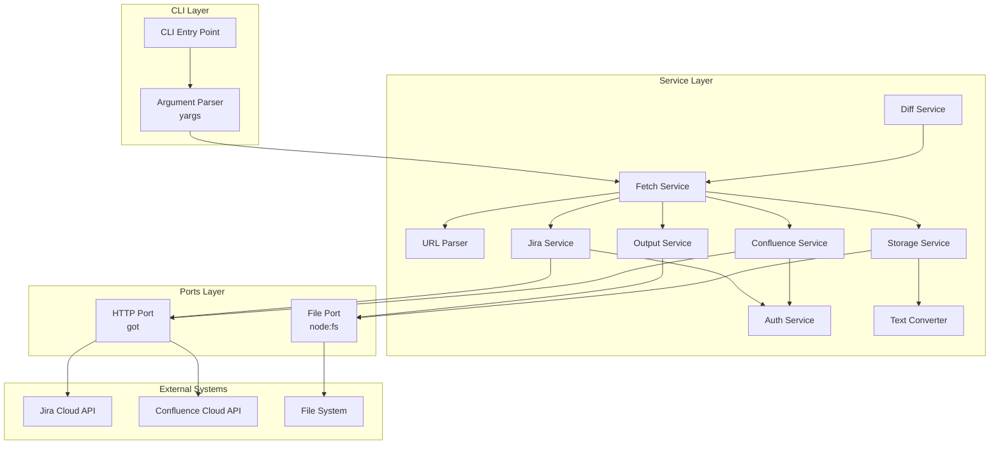
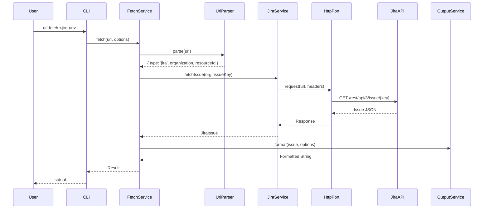
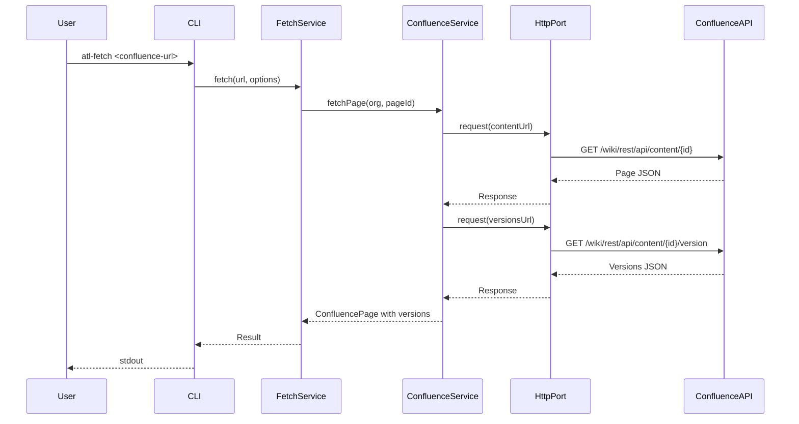
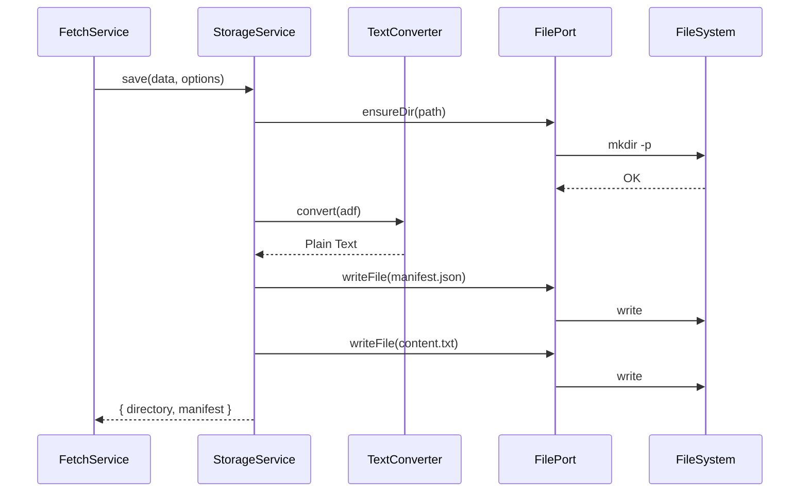
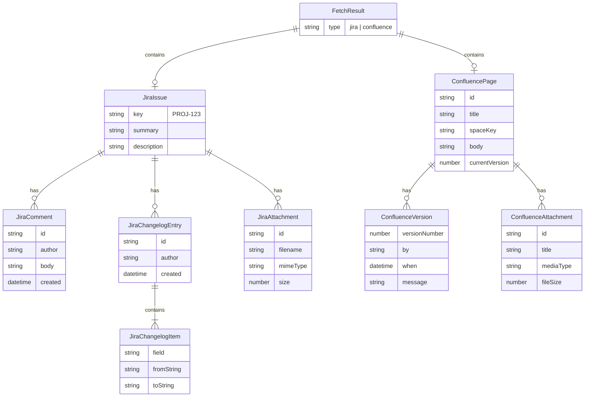
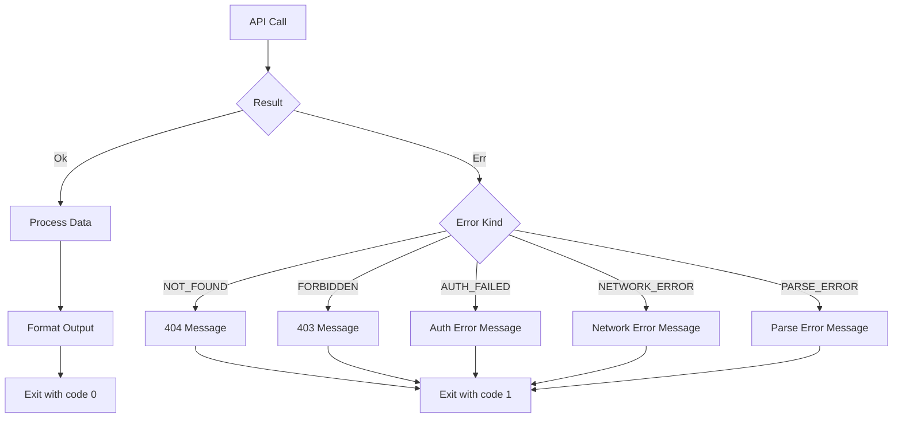

# アーキテクチャ

atl-fetch の内部アーキテクチャを説明します。

## 全体構成

atl-fetch は**レイヤードアーキテクチャ**と **Ports パターン**を採用しています。



## レイヤー説明

### CLI Layer

ユーザーからの入力を処理するレイヤーです。

| コンポーネント         | 役割                             |
| --------------- | ------------------------------ |
| CLI Entry Point | メインエントリーポイント（`src/cli/cli.ts`） |
| Argument Parser | yargs によるコマンドライン引数解析           |

### Service Layer

ビジネスロジックを実装するレイヤーです。

| コンポーネント           | 役割                                | 主な依存                                      |
| ----------------- | --------------------------------- | ----------------------------------------- |
| FetchService      | 統合サービス。URL 解析→取得→出力を調整            | UrlParser, JiraService, ConfluenceService |
| UrlParser         | Atlassian Cloud URL の解析・バリデーション   | -                                         |
| AuthService       | 環境変数から認証情報を取得、Basic Auth ヘッダー生成   | @t3-oss/env-core, zod                     |
| JiraService       | Jira Cloud API との通信               | HttpPort, AuthService                     |
| ConfluenceService | Confluence Cloud API との通信         | HttpPort, AuthService                     |
| DiffService       | テキスト差分の計算と表示                      | diff ライブラリ                                |
| OutputService     | JSON/Markdown/YAML 形式への変換         | yaml ライブラリ                                |
| StorageService    | ディレクトリ構造での保存                      | FilePort, TextConverter                   |
| TextConverter     | ADF/Storage Format からプレーンテキストへの変換 | -                                         |

### Ports Layer

外部依存を抽象化するレイヤーです。テスト時にモックに差し替え可能です。

| コンポーネント  | 役割          | 実装               |
| -------- | ----------- | ---------------- |
| HttpPort | HTTP 通信の抽象化 | got ライブラリ        |
| FilePort | ファイル操作の抽象化  | node:fs/promises |

## データフロー

### Jira Issue 取得フロー



### Confluence ページ取得フロー



### ディレクトリ保存フロー



## ドメインモデル



## エラーハンドリング

atl-fetch は **Result 型パターン**を採用しています。例外を投げずに、成功/失敗を型安全に表現します。



### エラー種別

| カテゴリ         | エラー種別             | HTTP ステータス | ユーザー向けメッセージ     |
| ------------ | ----------------- | ---------- | --------------- |
| User Error   | URL\_PARSE\_ERROR | -          | URL 形式のヘルプを表示   |
| User Error   | AUTH\_FAILED      | 401        | API トークン設定方法を案内 |
| User Error   | FORBIDDEN         | 403        | 権限確認を促す         |
| User Error   | NOT\_FOUND        | 404        | URL の確認を促す      |
| System Error | NETWORK\_ERROR    | -          | リトライ案内          |
| System Error | PARSE\_ERROR      | -          | バグ報告を依頼         |

## 技術スタック

| カテゴリ       | ライブラリ            | バージョン | 用途               |
| ---------- | ---------------- | ----- | ---------------- |
| CLI        | yargs            | 18.x  | コマンドライン引数解析      |
| HTTP       | got              | 14.x  | Atlassian API 通信 |
| Result     | neverthrow       | 8.x   | 型安全なエラーハンドリング    |
| Validation | zod              | 4.x   | スキーマバリデーション      |
| Env        | @t3-oss/env-core | 0.x   | 環境変数バリデーション      |
| Diff       | diff             | 8.x   | 差分計算             |
| YAML       | yaml             | 2.x   | YAML 出力          |
| Runtime    | Node.js          | 22+   | 実行環境             |

## ディレクトリ構造

```text
src/
├── index.ts              # ライブラリエントリーポイント
├── cli/
│   ├── cli.ts            # CLI 実装
│   └── index.ts          # CLI エクスポート
├── services/
│   ├── auth/             # 認証サービス
│   ├── confluence/       # Confluence サービス
│   ├── diff/             # 差分サービス
│   ├── fetch/            # 統合サービス
│   ├── jira/             # Jira サービス
│   ├── output/           # 出力サービス
│   ├── storage/          # ストレージサービス
│   ├── text-converter/   # テキスト変換
│   └── url-parser/       # URL パーサー
├── ports/
│   ├── file/             # ファイル操作ポート
│   └── http/             # HTTP 通信ポート
└── types/
    ├── auth.ts           # 認証関連型
    ├── confluence.ts     # Confluence 関連型
    ├── diff.ts           # 差分関連型
    ├── fetch.ts          # Fetch 関連型
    ├── file.ts           # ファイル関連型
    ├── http.ts           # HTTP 関連型
    ├── jira.ts           # Jira 関連型
    ├── output.ts         # 出力関連型
    ├── storage.ts        # ストレージ関連型
    └── url-parser.ts     # URL パーサー関連型
```

## 設計原則

1. **Layered Architecture**: 責務を明確に分離
2. **Ports パターン**: 外部依存を抽象化してテスト容易性を確保
3. **Result 型**: 例外を使わない型安全なエラーハンドリング
4. **Immutable Data**: readonly 修飾子による不変データ構造
5. **Discriminated Union**: 型安全な判別共用体でリソースタイプを区別
